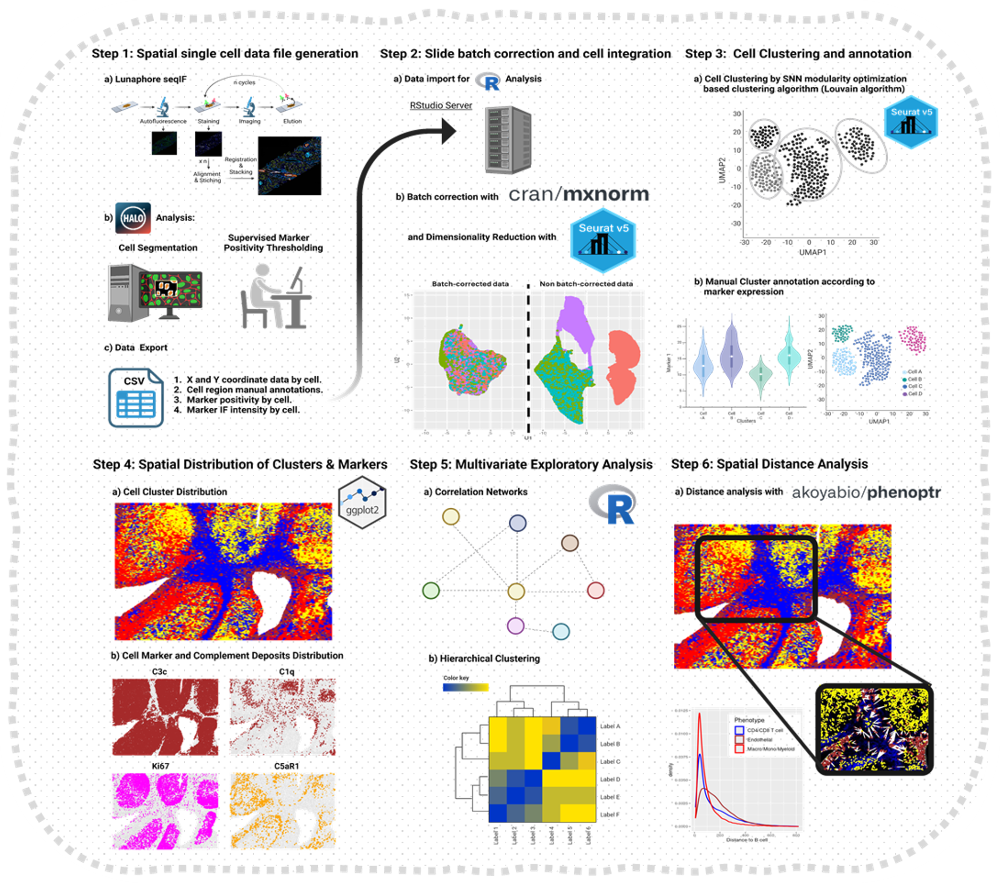

# Kidney-Hyperplex


## Project Overview

Kidney-Hyperplex is a bioinformatics project focused on the analysis of kidney tissue using high-dimensional (hyperplexed) spatial data. 
The repository contains all code and scripts used to process, analyze, and visualize data for the associated manuscript: *Development of in situ Complementomics for the discovery of therapeutic complement targets*

## Table of Contents
- [Project Overview](#project-overview)
- [Repository Structure](#repository-structure)
- [Getting Started](#getting-started)
- [Reproducing Figures](#reproducing-figures)
- [Dependencies](#dependencies)
- [Data Access](#data-access)
- [Citation](#citation)
- [Contact](#contact)

## Repository Structure

```
Figures/                   # Scripts to generate each figure in the manuscript
Data Processing Scripts/   # Scripts for raw data import, processing, and annotation
```

## Getting Started

1. **Clone the repository:**
   ```bash
   git clone https://github.com/Mikel-Rezola-Artero/Kidney-Hyperplex.git
   cd Kidney-Hyperplex
   ```

2. **Install dependencies:**
   - See [Dependencies](#dependencies) for required R and Python packages.

3. **Prepare data:**
   - Download processed or raw data (see [Data Access](#data-access)).
   - Place files in the `Data/` directory as referenced by the scripts.

4. **Reproduce figures:**
   - Run scripts in the `Figures/` folder as described below.

## Reproducing Figures

Each script in `Figures/` generates the panels for a figure in the manuscript.
- Scripts are named according to their corresponding figure (e.g., `03.Figure 1B-D.R`).
- Run scripts using R (RStudio recommended):
   ```R
   source("Figures/03.Figure 1B-D.R")
   ```
   
## Dependencies

### R packages
- `Seurat`
- `ggplot2`
- `dplyr`
- `tidyr`
- `patchwork`
- `ggpubr`
- `reticulate`
- `mxnorm`
- `plotly`
- `SingleCellExperiment`
- `pheatmap`
- and others (see top of scripts for full list).

### Python packages (if using image analysis scripts)
- `scikit-image`
- managed via `conda` environment

#### Reproducibility
- See the `sessionInfo()`.

## Data Access

Raw and processed data are not included in this repository.
- To request raw cell segmentation data from the authors, please contact the original publication corresponding author: lubka.roumenina@sorbonne-universite.fr
- Scripts expect raw data files in the `Data/` or `Data2/` directories.

## Citation

If you use this code, please cite:
- *Development of in situ Complementomics for the discovery of therapeutic complement targets*

## Contact

For questions or collaboration, contact:
- Mikel Rezola-Artero (mikel.rezola@gmail.com)
